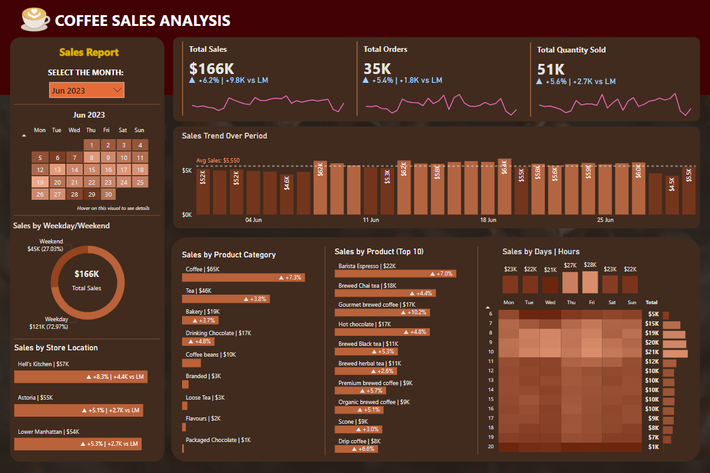

# Coffee Sales Analysis with Power BI and MySQL

## Project Overview
This repository contains a Coffee Sales Analysis dashboard designed to analyze sales data for a coffee shop. The goal is to gain insights into daily sales trends, popular products, and peak business hours. The dashboard provides visualizations and interactive features to explore the data effectively.



## Features
- **Sales Overview**: Provides a quick summary of total sales, orders, quantity sold, and month-on-month differences, with a customizable filter for viewing specific months.

- **Time-Based Trends**: Features interactive visualizations, including:
  - Calendar heatmap color-coded by sales volume with tooltips showing detailed metrics (sales, orders, quantity sold) on hover.
  - Bar chart displaying daily sales with an average sales line for comparison.
  - Pie chart comparing sales percentages on weekdays versus weekends.
  - Heatmap visualization of sales patterns by days and hours, with detailed metrics on hover.

- **Store Analysis**: Visualizes sales by store location to identify top-performing stores.

- **Product Performance**: Provides a detailed analysis of sales by product category and individual products.

## Insights
Key insights from the Coffee Sales Analysis Dashboard reveal:
- **Revenue Growth**: In June, the coffee shop achieved total sales of $166,000 in June, with 35K orders processed, marking a 6% increase from May. This positive growth trend indicates growing customer demand and operational efficiency.
- **Sales Patterns**: The3rd and 4th weeks of June consistently experienced sales above the average, reflecting sustained customer interest and higher transaction volumes during this period.
- **Peak Business Hours**: The heatmap shows pronounced peak business hours between 7AM to 10AM, indicating high customer activity during morning rush hours.
- **Optimal Sales Days**: Thursday and Fridays consistenly exhibit higher sales compared to other days, suggesting prime opportunities for product launches or promotional activities to maximize sales potential. 
- **Store Performance**: Hell's Kitchen emerged as the top performer with $57,000 in sales, closely followed by Astoria ($55,000) and Lower Manhattan ($54,000), suggesting balanced performance across different locations.
- **Best-Selling Categories and Products**: Coffee dominates in sales volume, followed by Tea and Bakery products. The standout best-selling products include the "Barista Espresso" generating $22,000, followed closedly by "Brewed Chai Tea" with $18,000 and "Gourmet Brewed Coffee" at $17,000, underscoring consumer preferences and revenue-driving products within the shop's offerings.

By following these steps, you can effectively incorporate SQL queries into your Sales Analysis Dashboard README on GitHub. This approach enhances the documentation's completeness and provides users with transparency and insights into the data processing and analysis methods used in your project.

## SQL Queries
To ensure the accuracy and reliability of the insights presented in the dashboard, the following MySQL queries were developed. These queries are designed to extract and manipulate data, enabling deeper analysis and addressing key business challenges identified within the dashboard:
1. **Total Sales and Orders for Each Month**:
    ```sql
    With Sales AS (
        SELECT
            DATE_FORMAT(transaction_date, '%Y-%m') AS month,
            ROUND(SUM(transaction_qty * unit_price)) AS total_sales,
            COUNT(transaction_id) AS total_orders,
            SUM(transaction_qty) AS total_qty_sold
        FROM coffee_sales
        GROUP BY month
    )
    SELECT
        month,
        CONCAT(ROUND(total_sales/1000), 'K') AS total_sales,
        CONCAT(ROUND(total_orders/1000), 'K') AS total_orders,
        CONCAT(ROUND((total_sales - LAG(total_sales, 1) OVER (ORDER BY month)) / LAG(total_sales, 1) OVER (ORDER BY month) * 100), '%') AS sales_diff_pct
    FROM Sales;
    ```
2. **Sales Trends by Days**:
    ```sql
    SELECT
    	CASE
            WHEN DAYOFWEEK(transaction_date) = 2 THEN 'Monday'
            WHEN DAYOFWEEK(transaction_date) = 3 THEN 'Tuesday'
            WHEN DAYOFWEEK(transaction_date) = 4 THEN 'Wednesday'
            WHEN DAYOFWEEK(transaction_date) = 5 THEN 'Thursday'
            WHEN DAYOFWEEK(transaction_date) = 6 THEN 'Friday'
            WHEN DAYOFWEEK(transaction_date) = 7 THEN 'Saturday'
            ELSE 'Sunday'
        END AS day_of_weeks,
        CONCAT(ROUND(SUM(transaction_qty * unit_price)/1000), 'K') AS total_sales
    FROM coffee_sales
    WHERE DATE_FORMAT(transaction_date, '%Y-%m') = '2023-06'
    GROUP BY day_of_weeks
    ORDER BY SUM(transaction_qty * unit_price) DESC;
    ```
    
3. **Sales Trends by Hours**:
   ```sql
    SELECT
       HOUR(transaction_time) AS hour_of_day,
       CONCAT(ROUND(SUM(transaction_qty * unit_price)/1000), 'K') AS total_sales
    FROM coffee_sales
    WHERE DATE_FORMAT(transaction_date, '%Y-%m') = '2023-06'
    GROUP BY hour_of_day
    ORDER BY hour_of_day;
    ```
   
 4. **Store Performance**:
    ```sql 
    SELECT
        store_location,
        CONCAT(ROUND(SUM(transaction_qty * unit_price)/1000), 'K') AS total_sales
    FROM coffee_sales
    WHERE DATE_FORMAT(transaction_date, '%Y-%m') = '2023-06'
    GROUP BY store_location
    ORDER BY total_sales DESC;
    ```

5. **Best-Selling Products Category**:
    ```sql
    SELECT
	    product_category,
        CONCAT(ROUND(SUM(transaction_qty * unit_price)/1000),'K') AS total_sales
    FROM coffee_sales
    WHERE DATE_FORMAT(transaction_date, '%Y-%m') = '2023-06'
    GROUP BY product_category
    ORDER BY SUM(transaction_qty * unit_price) DESC;
    ```
    
6. **Best-Selling Products Type**:
    ```sql
    SELECT
        product_type,
        CONCAT(ROUND(SUM(transaction_qty * unit_price)/1000), 'K') AS total_sales
    FROM coffee_sales
    WHERE DATE_FORMAT(transaction_date, '%Y-%m') = '2023-06'
    GROUP BY product_type
    ORDER BY SUM(transaction_qty * unit_price) DESC
    LIMIT 10;
    ```


## Skills Demonstrated

This project demonstrates the following skills:

- **Data Visualization**: Creating interactive and insightful visualizations to represent complex data.
- **Data Modeling**: Structuring and organizing data for efficient analysis.
- **DAX (Data Analysis Expressions)**: Writing advanced formulas to perform calculations and analysis.
- **SQL**: Writing and optimizing queries to extract and manipulate data.
- **Data Cleaning**: Preprocessing data to ensure accuracy and consistency.
- **Business Intelligence**: Leveraging BI tools to inform business decisions and strategy.

## References

This project was developed following the tutorial [Title of the Tutorial] by [Author/Instructor Name]. The tutorial can be found [here](link-to-tutorial).

